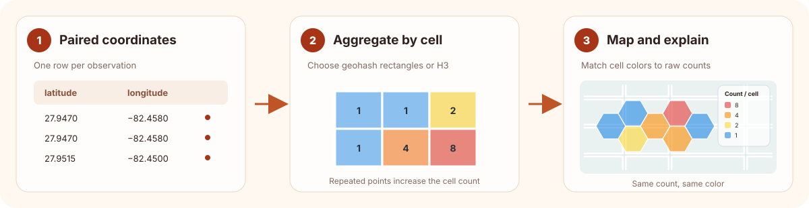

# Architecture and data flow

Heatfall is a local Python library for turning paired geographic coordinates
into static count maps. It does not upload observations to a Heatfall service.
Map tiles are a separate concern: when a tile provider is enabled, it receives
requests for the tiles in the map view.

## From coordinates to cells

The plotting functions and `Context.add_heat_hashes()` /
`Context.add_heat_h3s()` accept parallel latitude and longitude lists in
decimal degrees. Heatfall checks that their lengths match and that values fall
within geographic coordinate bounds.

Each observation is assigned to one geohash rectangle or H3 cell. Repeated
observations increment the same cell's count. Only occupied cells are drawn;
the count is the raw number of observations, not an area-normalized density.
Heatfall does not apply weights, smoothing, or polygon-to-cell filling.

## From counts to colors and legends

Each heat layer gets one count-to-color mapping. The default `"heatmap"`
palette maps the observed counts to up to five ordered color steps and uses
inclusive ranges in its legend. `"sequential"` maps counts along a blue ramp.
`"distinct"`, `"wheel"`, and `"random"` assign colors to distinct counts
without implying an order. `count_colors` supplies explicit colors when maps
need a stable comparison.

The final count-to-RGBA colors and layer summary are kept in immutable
`HeatLayerInfo` values exposed as `context.heat_layers`. The legend uses those
same colors. For H3 cells crossing the antimeridian, Heatfall splits the
geometry for display but retains one count and one metadata record for the
original cell.

## Rendering boundaries

`heatfall.Context` extends `landfall.Context`. Heatfall adds heat cell geometry,
records metadata, and draws the heat legend. Landfall and its py-staticmaps
dependency handle ordinary shapes, basemap tile providers, and image/vector
rendering. The plotting functions are convenience wrappers around a context
and return a Pillow image; use a context to set a fixed view or compose layers.

The default OpenStreetMap provider may make network requests when tiles are not
cached. Those requests disclose the map area needed to fetch the tiles to the
provider; Heatfall sends no coordinate list to a Heatfall server. Use
`staticmaps.tile_provider_None` for a tile-free render with no map-tile
requests. Provider availability, usage limits, attribution, and terms are
controlled by the provider. See [basemaps and output](basemaps.md) for setup
and attribution guidance.

## Where to look next

- [API reference](api.rst) for signatures and public metadata.
- [Data guide](data.md) for coordinate order and count semantics.
- [Performance guidance](performance.md) for input and rendering scale.
- [Geographic considerations](geography.md) for antimeridian and polar limits.
