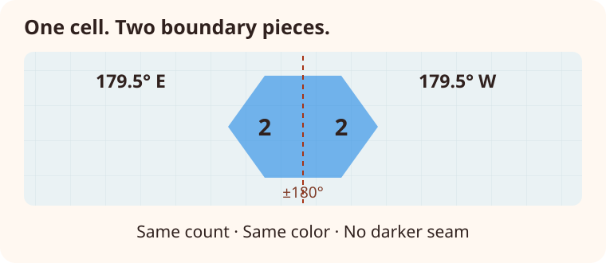

# Geographic considerations

::::{container} hf-section-intro
Keep coordinate order explicit, understand how H3 cells cross ±180°, and account
for the latitude limits of a tiled map.
::::

## Coordinate rules

| Input | Accepted range or order |
| --- | --- |
| Latitude | −90° to 90°, inclusive |
| Longitude | −180° to 180°, inclusive |
| Coordinate pairs | Latitude first, longitude second; decimal degrees |
| Geohash precision | Integer from 1 to 12 |
| H3 resolution | Integer from 0 to 15 |
| Fill opacity | Finite value from 0 to 1 |

- Supply parallel latitude and longitude lists in **latitude, longitude** order.
  GeoJSON positions commonly use the reverse order.
- Latitude must be between −90 and 90; longitude between −180 and 180, inclusive.
- Lists must have matching lengths. Non-finite values such as `NaN` and infinity
  raise `ValueError`.
- Precision must be an integer in the grid's supported range; opacity must be
  finite and between 0 and 1 inclusive.
- Standalone plotting functions reject empty lists. Adding an empty heat layer
  to a context is a no-op; add content before rendering it.
- Repeated coordinates count as repeated observations. Deduplicate first when
  your analysis should count unique locations.

## Crossing the antimeridian

H3 maps can contain points on both sides of ±180° longitude:

```python
import heatfall

image = heatfall.plot_heat_h3s(
    lats=[10.0, 10.0, 10.0],
    lons=[179.5, -179.5, 179.5],
    precision=3,
)
image.save("antimeridian.png")
```

Heatfall splits crossing H3 boundaries into closed polygons at the antimeridian,
using spherical intersections. The pieces share the original cell's count and
color and are composited together to avoid a darker transparency seam. Automatic
map extents follow the short span across the seam. Exact 180 and −180 longitude
are accepted.



*Schematic · Both boundary pieces represent the same cell; they are counted once.*

This behavior applies to rendered H3 cells. Polygon-to-cell filling of external
GeoJSON is outside Heatfall's point API.

## Polar limits

H3 rendering is clipped to the Web Mercator tile latitude limit of approximately
±85.0511°. Pole-containing cells close through their pole before clipping, but
these maps do not display the poles themselves.

## Next steps

See [troubleshooting](troubleshooting.md) for input errors, tile access, and
unexpected cell colors. [Basemaps and output](basemaps.md) explains fixed views
and SVG export.
