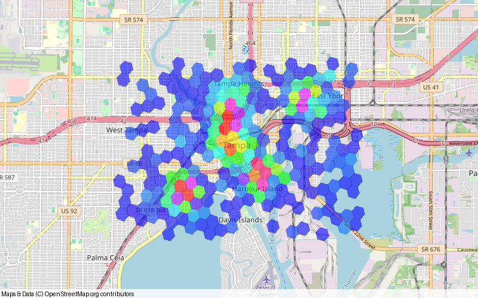
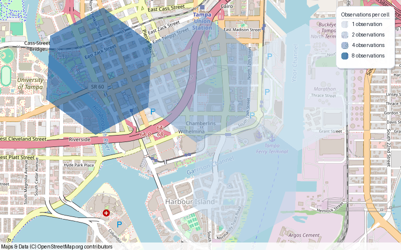
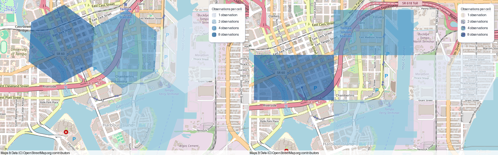

# Heatfall

::::{container} hf-hero
:::{container} hf-hero-copy
```{container} hf-kicker
Python · Geographic heat maps · {{release}}
```

<h2>See where your observations gather</h2>

Turn latitude and longitude lists into geohash or H3 heat maps. Count points
per cell, keep the basemap readable, and add routes or markers when you need
more context.

```{container} hf-actions
[Make your first map →](usage.md)
[Explore the API](api.rst)
```
:::
:::{container} hf-hero-image

:::
::::

## Find your path

::::{container} hf-card-grid
:::{container} hf-card
```{container} hf-label
01 · Start here
```
<h3>Make a first map</h3>

Install Heatfall, choose a grid, and save your first image with a runnable
15-observation example.

[Open the quick start →](installation.md)
:::
:::{container} hf-card
```{container} hf-label
02 · Bring your data
```
<h3>Count real observations</h3>

Read a CSV, convert coordinate pairs, and understand what each cell's count
and color represent.

[Prepare your points →](data.md)
:::
:::{container} hf-card
```{container} hf-label
03 · Compose a map
```
<h3>Add context and export</h3>

Overlay markers and routes, choose a basemap, set the view, or save vector
output with a map context.

[Explore map output →](basemaps.md)
:::
::::

## Two grids. One simple workflow.

These maps use the same synthetic observations and the public API in the
[usage guide](usage.md). Images are actual package output with OpenStreetMap
tiles and attribution.

::::{container} hf-gallery
:::{container}


*H3 · The default legend shows the observation count for each color.*
:::
:::{container}


*Geohash · Latitude/longitude rectangles, with precision from 1 to 12.*
:::
:::{container}


*Comparison · Fixed colors make equal counts match across both grids.*
:::
:::{container}


*Layers · Combine heat cells with Landfall points, routes, and circles.*
:::
::::

```{tip} Readable by default
Heat fills use **60% opacity**, leaving streets and labels visible. Legends are
enabled by default and use the exact fill colors. Set `opacity=0.4` for a softer
overlay or `opacity=1.0` for solid fills.
```

## From a few points to a finished image

```python
import heatfall

lats = [27.9470] * 8 + [27.9515] * 4 + [27.9430] * 2 + [27.9475]
lons = [-82.4580] * 8 + [-82.4500] * 4 + [-82.4475] * 2 + [-82.4400]

heatfall.plot_heat_h3s(
    lats, lons, precision=8, color_scheme="wheel", size=(800, 500)
).save("heatmap.png")
```

Each occupied cell is colored by its point count. Palettes assign colors to
count levels; they do not provide a sequential cool-to-hot scale. The heat
colors in this documentation's theme are independent of your map palette.

## Keep exploring

| I want to… | Start here |
| --- | --- |
| Choose cells, colors, and transparency | [Usage and styling](usage.md) |
| Plot across ±180° longitude | [Geographic considerations](geography.md) |
| Look up arguments and defaults | [API reference](api.rst) |
| Diagnose an unexpected map | [Troubleshooting](troubleshooting.md) |
| Add ordinary map shapes | [Landfall's shapes guide](https://landfall.readthedocs.io/en/latest/shapes-and-styling/) |
| Build docs or contribute a fix | [Development](development.md) |

```{toctree}
:hidden:
:maxdepth: 2
:caption: Learn

installation
usage
data
basemaps
geography
troubleshooting
```

```{toctree}
:hidden:
:maxdepth: 1
:caption: Reference

api
development
roadmap
releasing
changelog
```

Heatfall {{release}} · [GitHub](https://github.com/eddiethedean/heatfall) ·
[Report an issue](https://github.com/eddiethedean/heatfall/issues) ·
[MIT license](https://github.com/eddiethedean/heatfall/blob/main/LICENSE)
