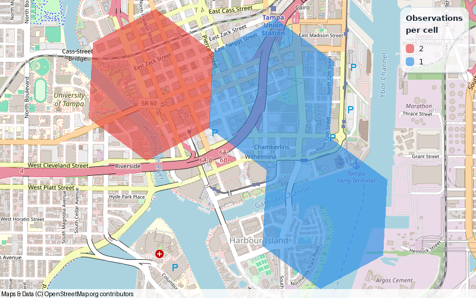

# Installation

::::{container} hf-section-intro
Make your first map with Heatfall **1.3.0**. Python **3.8–3.13** is supported;
the default basemap needs no API key.
::::

## Install from PyPI

Install the latest release:

```sh
python -m pip install heatfall
```

Heatfall 1.3.0 adds repeatable palette seeds, tile API-key forwarding, and
optional GIS and Cairo extras. To pin the version documented here:

```sh
python -m pip install "heatfall==1.3.0"
```

To install from source, including when this version is not yet available on
PyPI, use `main`:

```sh
python -m pip install "git+https://github.com/eddiethedean/heatfall.git@main"
```

Check your installed version:

```python
import heatfall

print(heatfall.__version__)
```

The default OpenStreetMap basemap requires network access when tiles are not
already cached. It needs no API key. Preserve provider attribution when sharing
images; basemap imagery has its own provider terms.

## Make your first map

Save a small H3 example with the default translucent fill:

```python
import heatfall

lats = [27.9470, 27.9470, 27.9515, 27.9430]
lons = [-82.4580, -82.4580, -82.4500, -82.4475]

image = heatfall.plot_heat_h3s(lats, lons, precision=8)
image.save("first-heatmap.png")
```

`image` is a Pillow image. In a notebook, put `image` on its own as the last
expression in a cell to display it. Coordinates are latitude first, longitude
second, in decimal degrees; repeated locations count as separate observations.



*Four observations, three occupied H3 cells. Repeated coordinates count twice.*

```{tip} Your first result
The default heatmap palette and legend are ready immediately. Use
`legend=False` to make an unobstructed map for a later layout step.
```

Continue with [usage and styling](usage.md) for the illustrated example,
[prepare your point data](data.md) to load a CSV, or
[basemaps and output](basemaps.md) to configure a view and export SVG.

## Dependencies

Installation brings in [Landfall](https://github.com/eddiethedean/landfall) for map
composition and colors, [Geodude](https://github.com/eddiethedean/geodude) and
[PyGeodesy](https://github.com/mrJean1/PyGeodesy) for geohashes, and
[H3](https://github.com/uber/h3-py) for H3 cells.
[py-staticmaps](https://github.com/flopp/py-staticmaps), installed through
Landfall, supplies the map context, tile handling, and renderers. Its Python
module is named `staticmaps`, as used in the examples. Pillow supplies raster
image operations. Landfall's
[getting started guide](https://landfall.readthedocs.io/en/latest/getting-started/)
covers ordinary map layers and image output, and its
[troubleshooting guide](https://landfall.readthedocs.io/en/latest/troubleshooting/)
covers tile access and optional dependencies.

See [py-staticmaps interoperability](staticmaps.md) for native objects and context
controls available through the `staticmaps` import.

Heatfall 1.3.0 requires Landfall **0.5.0 or newer**. Installing or upgrading
Heatfall installs the required Landfall version automatically.

## Optional GIS dependencies

GeoJSON composition uses the standard installation. To combine heat layers with
Shapely geometries or GeoDataFrames, install Heatfall's GIS extra:

```sh
python -m pip install "heatfall[geo]"
```

To install the same extra from source:

```sh
python -m pip install "heatfall[geo] @ git+https://github.com/eddiethedean/heatfall.git@main"
```

See [compose other layers](usage.md#compose-other-layers) for GeoJSON and
GeoDataFrame examples. The GIS dependencies are optional; the ordinary heat
plotting functions do not need them.

## Optional Cairo rendering

The `cairo` extra installs Landfall's optional Cairo dependencies for
anti-aliased PNG rendering through `context.render_cairo()`:

```sh
python -m pip install "heatfall[cairo]"
```

To install the same extra from source:

```sh
python -m pip install "heatfall[cairo] @ git+https://github.com/eddiethedean/heatfall.git@main"
```

The Python Cairo extension may need native system libraries. See
[Cairo setup and rendering](basemaps.md#optional-cairo-rendering) for platform
requirements and a complete example. Combine the 1.3.0 extras as
`heatfall[geo,cairo]` when both GIS overlays and Cairo output are needed.
