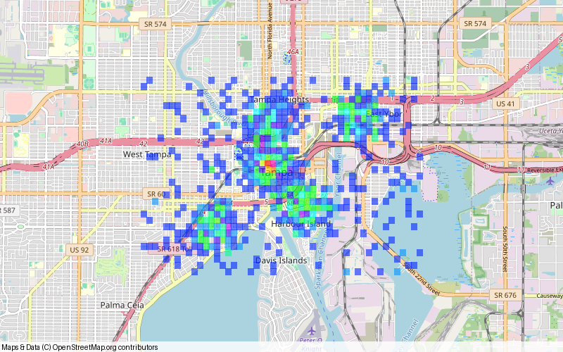
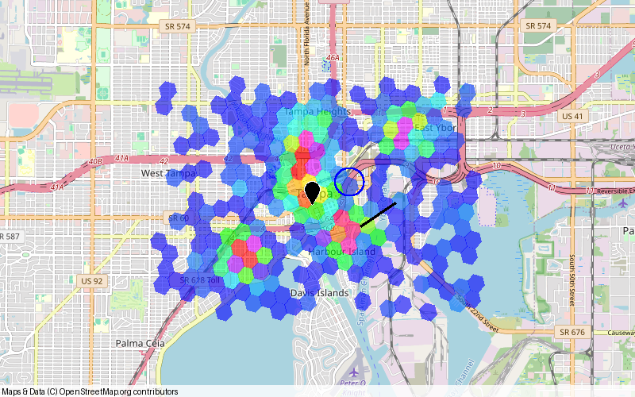

# Usage

## Create an H3 heatmap

This example contains 15 synthetic observations around downtown Tampa. Repeated
coordinates deliberately produce cells with different counts.

```python
import heatfall

lats = [27.9470] * 8 + [27.9515] * 4 + [27.9430] * 2 + [27.9475]
lons = [-82.4580] * 8 + [-82.4500] * 4 + [-82.4475] * 2 + [-82.4400]

image = heatfall.plot_heat_h3s(
    lats, lons, precision=8, color_scheme="wheel", size=(800, 500)
)
image.save("h3-heatmap.png")
```

The plotting functions return a `PIL.Image.Image`, automatically fitting the map
to the occupied cells. `size` is `(width, height)` in pixels.

## Choose a grid

| | Geohash | H3 |
| --- | --- | --- |
| Function | `plot_heat_hashes()` | `plot_heat_h3s()` |
| Cell shape | Latitude/longitude rectangles | Mostly hexagons, plus pentagons |
| Precision range | 1–12 | 0–15, called resolution in H3 |
| City-scale starting point | `precision=6` | `precision=8` |

Higher precision means smaller cells. Lower it when most cells contain a single
observation. The two grids' precision scales differ: level 8 in one grid does not
imply the same cell size as level 8 in the other.

Create a geohash map from the same observations:

```python
image = heatfall.plot_heat_hashes(
    lats, lons, precision=6, color_scheme="wheel", size=(800, 500)
)
image.save("geohash-heatmap.png")
```



## Colors and opacity

Each observation contributes one count to its cell. Only occupied cells are
drawn. Within a layer, cells with the same count share a color; different count
levels receive different palette colors.

| `color_scheme` | Behavior |
| --- | --- |
| `"distinct"` (default) | Generates distinct colors for the count levels |
| `"wheel"` | Selects colors from an HSV color wheel |
| `"random"` | Generates random colors for the count levels |

The palettes do not guarantee a sequential light-to-dark or cool-to-hot scale.
A red cell does not inherently indicate a higher count. Palettes are assigned
per layer, and distinct/random colors may vary between calls.

Fills default to **60% opacity (40% transparent)**. Both plotting functions and
`Context` heat methods accept the keyword-only `opacity` option:

```python
# Softer cells, showing more of the basemap.
image = heatfall.plot_heat_h3s(lats, lons, precision=8, opacity=0.4)

# Restore solid fills.
image = heatfall.plot_heat_hashes(lats, lons, precision=6, opacity=1.0)
```

Opacity must be between 0 and 1 inclusive; 0 makes the fill invisible. It applies
uniformly to the layer and does not encode the observation count.

The result shows raw counts per cell. It does not normalize by cell area, smooth
counts, accept observation weights, or add a numeric legend.

## Compose other layers

`heatfall.Context` extends `landfall.Context`. Add heat cells first, then points,
routes, and circles to draw those objects above the heat layer:

```python
context = heatfall.Context()
context.add_heat_h3s(lats, lons, precision=8, color_scheme="wheel")
context.add_points([27.9470], [-82.4580], colors=["black"], point_size=10)
context.add_line([(27.9430, -82.4475), (27.9475, -82.4400)], color="black", width=3)
context.add_circles(
    [27.9515], [-82.4500], [300], color="blue", fill_color="transparent", width=2
)
context.render_pillow(800, 500).save("layered-heatmap.png")
```



See Landfall's [Context API](https://landfall.readthedocs.io/en/latest/api/#context)
for inherited layer methods, and its
[shapes and styling guide](https://landfall.readthedocs.io/en/latest/shapes-and-styling/)
for point sizes, line widths, circle radii, and overlay colors.

Configure the basemap with `context.set_tile_provider(provider)`. For standalone
functions, the argument is spelled `tileprovider`, without an underscore.
`Context` also inherits py-staticmaps' SVG and optional Cairo rendering methods.
Landfall documents [custom tile services](https://landfall.readthedocs.io/en/latest/custom-tile-service/)
and [combining shapes and exporting SVG](https://landfall.readthedocs.io/en/latest/shapes-and-styling/#combine-shapes-and-export-svg).
